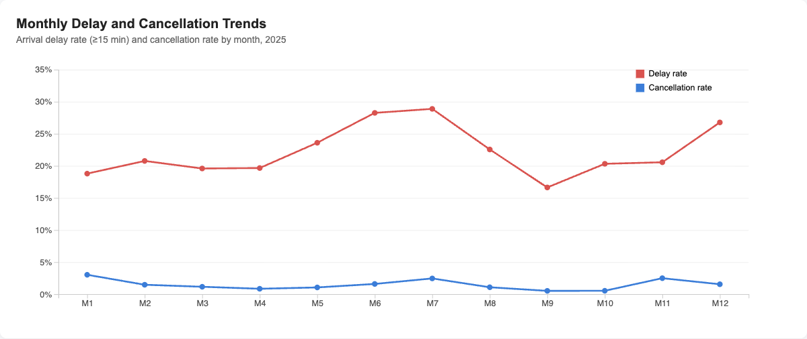
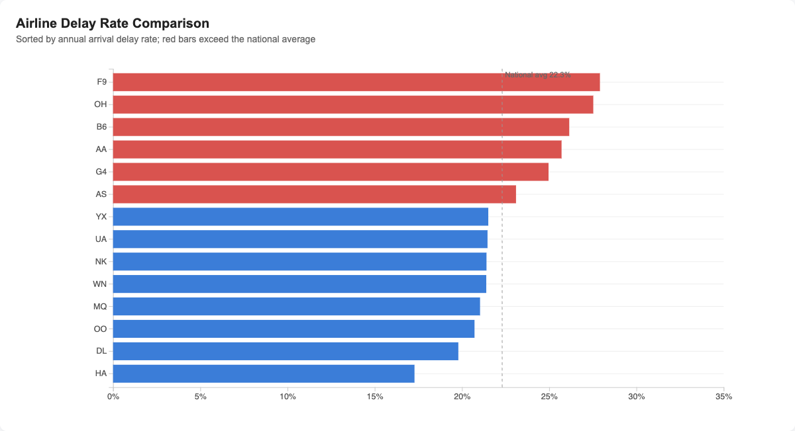
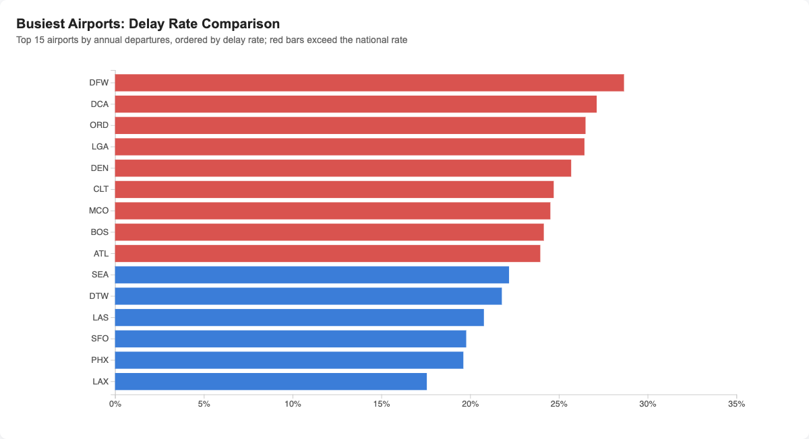
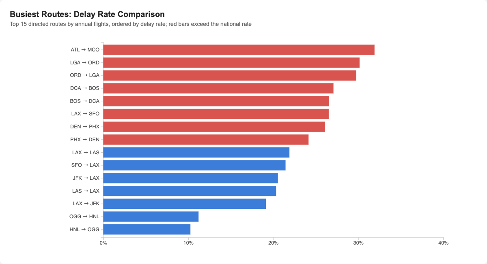
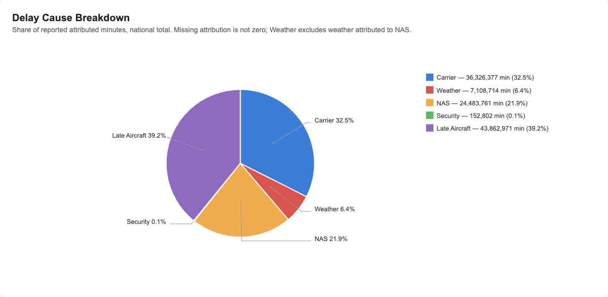
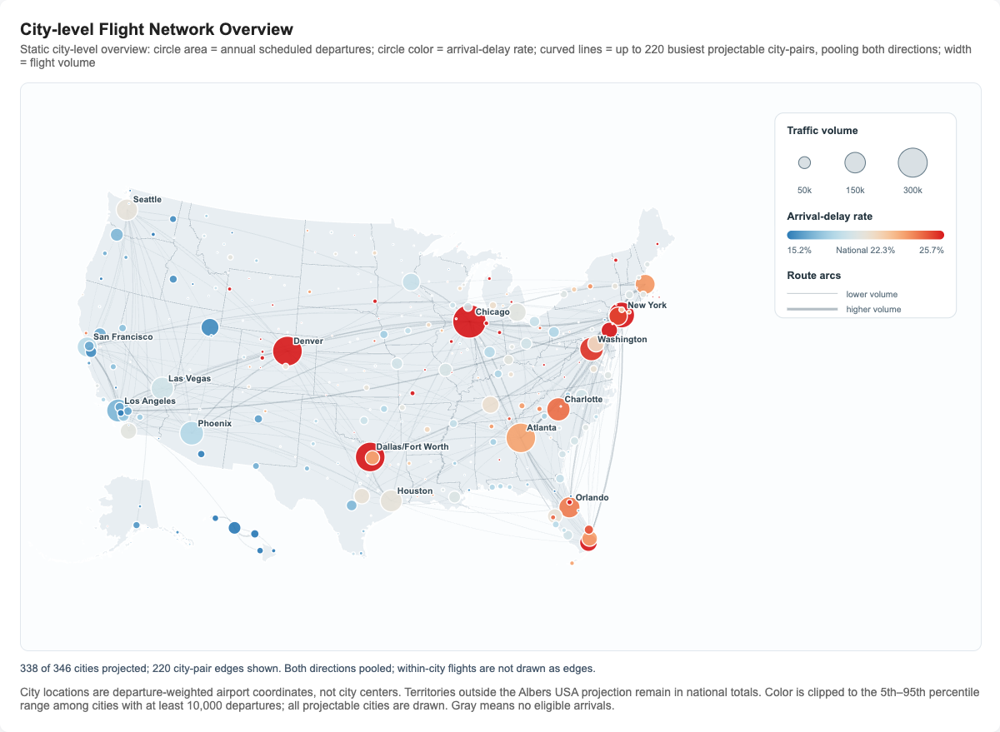

# Interim Check: U.S. Domestic Flight Reliability

**Member: Henghao Jiang, Linjin Di, Hanchi Zhao.**

**Date: September 20, 2026.**

This page presents our verified dataset, six implemented D3 visualizations, and plans
for coordinated interaction and evaluation. All figures below were exported from the
working dashboard using actual 2025 project data; they are not sketches or mockups.

[Run the dashboard](../README.md#view-the-dashboard) · [Proposal](../proposal.md) ·
[Data quality report](../reports/quality_report.md) · [Browser checks](../reports/site_validation.json)

## 1. Dataset

### Raw datasets

- **Flight records:** twelve BTS Reporting Carrier On-Time Performance monthly archives,
  `data/raw/flights/2025-01.zip` through `2025-12.zip`. They cover 7,001,619 reported
  domestic flight records from January 1 through December 31, 2025, including territories.
  Coverage is limited to reporting carriers, not every U.S. flight.
- **Airport metadata:** the BTS Master Coordinate archive,
  `data/raw/airports/master_coordinate.zip`, supplies identifiers, names, cities, states,
  coordinates, and validity dates. Source URLs and SHA-256 checksums are retained in
  the local download manifests.

Official sources: [BTS flight data](https://www.transtats.bts.gov/DL_SelectFields.aspx?QO_fu146_anzr=b0-gvzr&gnoyr_VQ=FGJ)
and [BTS airport metadata](https://www.transtats.bts.gov/DL_SelectFields.aspx?QO_fu146_anzr=N8vn6v10+f722146+gnoyr5&gnoyr_VQ=FLL).

### Processed datasets and completed cleaning

Monthly `data/processed/flights_2025_MM.parquet` partitions retain all 7,001,619 records,
with 31 source fields and seven derived fields. The used airport metadata contains
510 sequence versions representing 352 airports. We standardized types, checked dates
and duplicates, derived weekday/departure-hour/directed-route fields, and preserved
cancellations, diversions, nulls, observed zeros, and source anomalies.

Origin and destination metadata were checked using **AirportSeqID**, with many-to-one
joins, unchanged row counts, coordinate checks, and historical validity checks. All used
sequence identifiers matched. We retained one noncancelled, nondiverted flight with
missing arrival delay and 14 delayed records with zero minutes across all five cause fields.

Local `data/summaries/` tables retain counts, denominators, and attribution observation
counts. The reproducible [website snapshot](../site/data/) contains national, monthly,
airline, airport, directed-route, city, and city-pair summaries. Raw and large processed
data are not committed; [data documentation](../data/README.md) explains reproduction.

### Metric definitions

- **Arrival-delay rate:** arrivals at least 15 minutes late divided by noncancelled,
  nondiverted flights with observed arrival delay.
- **Cancellation/diversion rates:** cancelled/diverted records divided by all scheduled records.
- **Airport/city reliability:** arrival outcomes of flights departing from that location.
- **Cause shares:** shares of reported attributed minutes, not shares of flights or
  causal explanations. Missing attribution is not zero; WeatherDelay excludes weather
  effects attributed to other categories such as NAS.

Rates are recomputed from pooled counts. The national arrival-delay rate is **22.31%**;
comparisons do not average airport or airline percentages.

## 2. Implemented Visualizations

The first three charts satisfy the minimum of three working static visualizations.
The remaining charts provide additional views. KPI cards supplement these figures and
are not counted toward that minimum. Desktop screenshots include the actual chart titles
and legends; the live page also supports tabs and hover details on the first five charts.

### 2.1 Monthly delay and cancellation trends

**Question:** How does reliability vary across months?\
**Encoding and data:** month on the horizontal axis, rate on the vertical axis; red is
arrival delay and blue is cancellation. Source: [`monthly.csv`](../site/data/monthly.csv).
The two rates have different denominators, as defined above.\
**Observation:** arrival-delay rates rise in June–July and December and are lowest in
September. This describes seasonal variation without identifying its causes.

### 2.2 Airline delay-rate comparison

**Question:** How do reporting airlines compare with the national baseline?\
**Encoding and data:** horizontal bar length is arrival-delay rate, ordered from high
to low. Red bars exceed the pooled national rate, shown by the dashed line. Source:
[`airline_annual.csv`](../site/data/airline_annual.csv), covering 14 reporting airlines.\
**Observation:** the chart shows variation across airlines, but differences in routes,
seasons, and operating conditions prevent a causal airline-quality interpretation.

### 2.3 Delay rates at the busiest airports

**Question:** How do delay rates differ among the busiest origin airports?\
**Encoding and data:** select the 15 airports with the most annual departures, then
order their bars by arrival-delay rate. Red bars exceed the national rate. Source:
[`airport_annual.csv`](../site/data/airport_annual.csv).\
**Interpretation:** these are outgoing-flight arrival outcomes. This is neither a ranking
of all airports nor a count of aircraft arriving late at the displayed airport.

### 2.4 Delay rates on the busiest directed routes

**Question:** Which heavily used directed routes have higher delay rates?\
**Encoding and data:** select the 15 routes with the most flights, then order by arrival-delay
rate; red bars exceed the national rate. Labels preserve Origin → Destination direction.
Source: [`route_annual.csv`](../site/data/route_annual.csv).\
**Interpretation:** reverse directions are separate observations. High delay rates alone
do not establish that a corridor is congested.

### 2.5 National reported delay attribution

**Question:** How are reported delay minutes distributed across BTS attribution categories?\
**Encoding and data:** pie-slice angle encodes a category's share of reported minutes;
labels and the legend provide shares and minutes. Source: [`national.csv`](../site/data/national.csv).\
**Observation:** Late Aircraft has the largest reported share (39.19%), followed by Carrier
(32.45%). These are attributed-minute shares; the 14 zero-cause anomalies remain in the
delay-rate denominator but contribute no attributed minutes. A comparative stacked-bar
view remains planned.

### 2.6 City-level flight network overview

**Question:** Where are large departure volumes and higher city-level delay rates located?\
**Encoding and data:** circle area represents departures; color represents arrival-delay
rate. Neutral-colored arcs show the 220 busiest projectable city pairs, with width encoding
volume and both directions pooled. Sources: [`city_summary.csv`](../site/data/city_summary.csv)
and [`city_routes.csv`](../site/data/city_routes.csv).\
**Limitations:** the map projects 338 of 346 cities; excluded territories remain in national
totals. City positions are departure-weighted historical airport coordinates. Cities may
contain multiple airports, such as Chicago's ORD and MDW. Within-city flights contribute to
node totals but are excluded from pair edges. Color endpoints use the 5th and 95th percentiles
among cities with at least 10,000 departures; values beyond those endpoints are clipped.
This is a city overview, not yet an airport drill-down or a directed-route map.

## 3. Interaction / Animation Plan

The plans below are not claimed as completed functionality. Existing tabs and chart
hover details provide basic navigation; coordinated filtering and map selection remain future work.

- **Monthly trends:** brush a month range to update other views; animate position changes
  briefly to help users follow seasonal comparisons. Show the active period explicitly.
- **Airline comparison:** select an airline to filter compatible views and show its counts
  and denominators. Provide a reset to the national view for comparison.
- **Airport comparison:** select an airport to open its monthly trend, attributed-minute
  composition, and busiest outgoing routes. This supports movement from overview to detail.
- **Directed routes:** hover for counts, eligible arrivals, delay and cancellation rates;
  select an origin to compare its outgoing routes. Preserve direction in labels and selection.
- **Delay attribution:** add airport/airline comparison using 100% stacked bars, with category
  highlighting and observation counts. This supports comparison without treating missing data as zero.
- **City map:** hover nodes/edges for city membership and pooled counts, and select a city
  to choose an individual airport before opening airport detail. Offer a route-count control
  to manage clutter. Do not silently treat a multi-airport city as one airport.
- **KPI cards:** consider a metric switch between delay, cancellation, and diversion after
  compatible data and legends are available across linked views.

Month/airline filters will use the existing finer-grained local summaries, exported in
compact partitions as needed. The present annual publication files cannot provide those
filters. Filtered rates will always be recomputed from pooled numerators and denominators.
The proposal's temporal heatmap and volume–reliability scatterplot remain future views.

## 4. Evaluation Plan

### What we will evaluate

We will evaluate reading accuracy, understanding of denominators and airport/city scope,
clarity of encodings, consistency of coordinated selection, and responsiveness. We will
also check whether users distinguish reported attribution from causal explanation.

### How we will evaluate

First, group members will audit chart values against exported summaries and walk through
navigation, reset, loading failures, and keyboard access. We then plan a small formative
test with 3–5 classmates using the current static views:

1. Find the month with the highest arrival-delay rate and read that month's cancellation rate.
2. Identify an airline above the national baseline and explain what the reference line means.
3. Find the highest delay rate among the 15 displayed airports and explain which flights it describes.

After linked interactions are implemented, add an airport-selection task, a month-change
task, and a reported-cause reading task. Prepare answer keys directly from the relevant
summaries. Record correctness separately from speed; a one-minute target is exploratory,
not a demonstrated outcome.

For performance, measure initial load separately from click-to-render latency using
browser timing tools, repeat representative actions, and record browser/device conditions.
A tentative target is under 500 ms for a local filter update after data loading.

### Data and feedback we will collect

Collect task correctness, completion time, requests for help, misunderstood labels or
metrics, short think-aloud comments, and a 1–5 clarity rating for each view. Record loading
and update timings, console errors, and interaction bugs. Use anonymous participant labels.
Prioritize incorrect interpretations and blocked tasks, then refine labels, layout, and
route density and repeat the affected tasks.

**Current validation is separate:** automated headless Chrome checks cover all six charts,
hover details, tab/keyboard navigation, mobile overflow, and loading failure/retry. Exported
figures were visually inspected. No participant study or performance-target evaluation
has been completed. See [browser evidence](../reports/site_validation.json).

## Next Steps and Contributions

Next, implement airport detail and compatible month/airline filtering, develop the
proposal's remaining views, and conduct the planned formative evaluation.

Current responsibilities recorded in the submitted interim draft are: **Henghao Jiang** —
data acquisition, cleaning, metric validation, and documentation; **Linjin Di** — national
KPI, monthly-trend, and airline-comparison views; **Hanchi Zhao** — geographic/network design.
All members review interpretations, test the integrated dashboard, and prepare the presentation.
These current responsibilities are recorded separately from the original proposal's planned roles.
